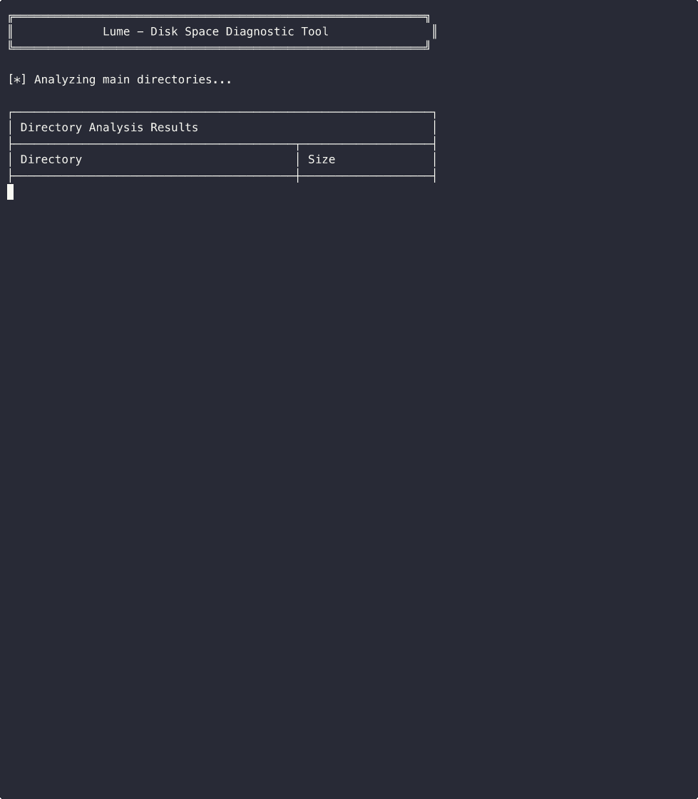

<div align="center">



# ✦ Lume

**Move, don't remove.**

[](https://go.dev)
[](https://www.apple.com/macos)
[](LICENSE)

*From Latin **lumen** — light. Let your disk space see the light again.*

[Install](#install) · [Why Lume?](#why-lume) · [Features](#features) · [Usage](#usage)

<br>


<p><i>Scan → Select → Clean to Trash — Safe & undoable</i></p>

</div>

---

## Install

```bash
curl -fsSL https://raw.githubusercontent.com/Tyooughtul/lume/main/install.sh | bash
```

No Homebrew tap. No `sudo make install`. No fuss.

---

## Why Lume?

Every other Mac cleaner uses `rm -rf`. **Lume doesn't.**

<table>
<tr>
<td width="50%" valign="top">

**✅ Lume**

- ✅ Always moves to macOS Trash — **fully undoable**
- ✅ If Trash fails, your file stays **untouched**
- ✅ **55+** scan targets with dynamic discovery
- ✅ 3-stage **SHA-256** duplicate detection — 0% false positives
- ✅ Concurrent worker pool — **seconds, not minutes**
- ✅ **Free** & open source

</td>
<td width="50%" valign="top">

**❌ Other Mac Cleaners**

- ❌ `rm -rf` — permanently deleted
- ❌ No safety net on failure
- ❌ ~10–20 scan targets
- ❌ Single-pass hashing
- ❌ Sequential scanning
- ❌ **$35+/year**, closed source

</td>
</tr>
</table>

### The Safety Guarantee

```
Delete request
  ├─ Tier 1: osascript → Finder moves to Trash    ← native macOS
  ├─ Tier 2: os.Rename → ~/.Trash/                ← same filesystem
  ├─ Tier 3: Copy to ~/.Trash/ → remove source    ← cross filesystem
  └─ All tiers fail? → ERROR reported. File untouched.
                        ↑
                  We NEVER fall back to rm.
```

---

## Features

### 🗑 System Junk — 55+ Scan Targets

57 built-in targets plus dynamic discovery of JetBrains IDEs, Chromium profiles, and Electron app caches — Lume finds caches other tools miss:

| Category | Targets |
| :--- | :--- |
| **Apple** | Xcode DerivedData / Archives / Simulators, Font Cache, Saved App State, WebKit |
| **IDEs** | JetBrains (10+ IDEs), VS Code, Android Studio — auto-discovered |
| **JavaScript** | npm, yarn, pnpm, node-gyp |
| **Python** | pip, Conda, Miniconda, Anaconda, virtualenv |
| **JVM** | Gradle, Maven (.m2), SBT, Ivy |
| **Systems** | Rust Cargo, Go Modules, Flutter / Dart |
| **DevOps** | Docker, Kubernetes, Helm, Terraform |
| **PHP / Ruby** | Composer, Gems |
| **Packagers** | Homebrew, CocoaPods, Carthage, SwiftPM |
| **Browsers** | Safari, Chrome, Firefox, Edge; Brave, Arc, Opera (dynamic) |
| **Electron** | Spotify, Discord, Slack, Teams, Zoom, Notion, Postman + more |

All scanning runs concurrently (`NumCPU` workers, max 8) — completes in seconds.

### 🔍 Duplicate Files — Zero False Positives

3-stage pipeline for speed AND accuracy:

```
100,000 files
  → Stage 1: Group by size              [instant, 0 I/O]          → 5,000
  → Stage 2: Quick hash (16KB head+tail) [parallel, minimal I/O]  → 200
  → Stage 3: Full SHA-256                [parallel, 256KB buffer]  → 50 true duplicates
```

**100 GB in ~10 seconds** on Apple Silicon · Up to 8 concurrent hashers · 256KB I/O buffer · Zero false positives

### 📦 App Uninstaller — 95%+ Residual Detection

Scans **11 Library directories** with **6 keyword variants** per app:

```
~/Library/Application Support/     ~/Library/Caches/
~/Library/Preferences/             ~/Library/Logs/
~/Library/Containers/              ~/Library/Group Containers/
~/Library/LaunchAgents/            ~/Library/Saved Application State/
~/Library/WebKit/                  ~/Library/HTTPStorages/
~/Library/Cookies/
```

### 📊 Disk Trend — 90-Day History

Track disk usage over time. Spot the leak before you run out of space.

### 📁 Large Files

Scans your home directory for files over 10 MB (configurable), sorted by size. Streaming metadata scan — no full file reads, no lag even on 10 GB+ files.

### 🌐 Browser Data

Per-browser, per-data-type control (cache, history, cookies) for Safari, Chrome, Firefox, and Edge. Brave, Arc, and Opera caches detected via the system junk scanner.

---


---

## Usage

```bash
lume              # Interactive TUI (recommended)
lume -diagnose    # Quick terminal report, no interaction
lume -help        # Show help
```

### Diagnose Mode

Quick terminal report without interaction — perfect for CI/CD or quick checks:

<p align="center">
  
</p>

### Keyboard Shortcuts

| Key | Action |
| :--- | :--- |
| `↑` `k` / `↓` `j` | Navigate |
| `Space` | Toggle selection |
| `Enter` | Confirm / Enter |
| `a` | Select all / none |
| `p` | Preview files |
| `d` `c` | Clean selected (→ Trash) |
| `r` | Refresh scan |
| `t` | Toggle theme |
| `Esc` | Back |
| `q` | Quit |

### Themes

Lume supports multiple color themes. Press `t` to cycle through themes.

**Built-in themes:**

| Theme | Style |
|-------|-------|
| `modern` (default) | Neon cyberpunk |
| `retro` | Matrix green terminal |
| `amber` | Vintage amber monitor |
| `ocean` | Deep blue ocean |
| `highcontrast` | Accessibility friendly |
| `dracula` | Classic Dracula colors |
| `solarized` | Solarized Dark |
| `monokai` | Code editor style |

<p align="center">
  
</p>

**Custom theme:**

Create `~/.config/lume/themes/mytheme.json`:

```json
{
  "name": "mytheme",
  "description": "My custom theme",
  "primary": "#ff6b6b",
  "secondary": "#4ecdc4",
  "accent": "#ffe66d",
  "danger": "#ff4757",
  "warning": "#ffa502",
  "success": "#2ed573",
  "foreground": "#f1f2f6",
  "gray": "#747d8c",
  "light_gray": "#a4b0be",
  "dim": "#57606f",
  "selected_bg": "#3742fa",
  "selected_fg": "#ffffff",
  "border": "#70a1ff"
}
```

See [assets/custom_theme_example.json](assets/custom_theme_example.json) for a complete example.

---

## Tech Stack

- **Go 1.21+** — single static binary, zero runtime dependencies
- **[Bubble Tea](https://github.com/charmbracelet/bubbletea)** — TUI framework
- **[Lip Gloss](https://github.com/charmbracelet/lipgloss)** — terminal styling
- **SHA-256** — cryptographic duplicate verification

<details>
<summary><b>Project Structure</b></summary>

```
lume/
├── cmd/lume/           # Entry point + diagnose mode
├── pkg/
│   ├── scanner/        # Scanning logic (junk, apps, duplicates, browser, disk)
│   ├── cleaner/        # Trash-based cleanup (3-tier strategy)
│   └── ui/             # Bubble Tea TUI views
├── Makefile
└── go.mod
```

</details>

## Contributing

```bash
git clone https://github.com/Tyooughtul/lume.git && cd lume
go mod download
go test ./...           # Run tests
go run ./cmd/lume/...   # Run locally
```

PRs welcome. Please run `go fmt` and add tests for new features.

## FAQ

<details>
<summary><b>Is it safe?</b></summary>

Everything goes to macOS Trash. If our 3-tier strategy fails entirely, the file stays where it is. We never fall back to permanent deletion.

</details>

<details>
<summary><b>Why not CleanMyMac?</b></summary>

CleanMyMac costs $35+/yr, uses `rm` not Trash, is closed-source, and finds fewer developer caches. Lume is free, open-source, 100% undoable, and built for developers.

</details>

<details>
<summary><b>Does it need sudo?</b></summary>

No. Lume only touches user-accessible files.

</details>

<details>
<summary><b>Performance impact?</b></summary>

< 50 MB RAM. Most scans finish in seconds. Non-blocking TUI with background goroutines.

</details>

---

<div align="center">

[MIT License](LICENSE)

**If Lume saved you disk space, consider giving it a ⭐**

</div>
